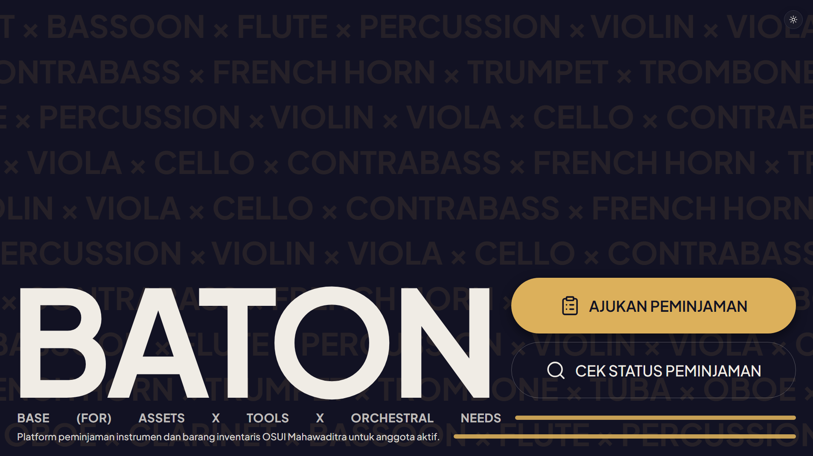

[](https://nextjs.org)
[](https://www.typescriptlang.org)
[](https://www.prisma.io)
[](https://supabase.com)
[](https://vercel.com)

# BATON

> Base for Assets, Tools, and Orchestral Needs


A web platform for OSUI Mahawaditra's Logistics division to manage instrument borrowing and inventory — replacing a patchwork of Google Forms, Sheets, and Word documents with one integrated system.


## Contents

- [BATON](#baton)
  - [Contents](#contents)
  - [Why is this a thing?](#why-is-this-a-thing)
  - [Features](#features)
    - [For borrowers](#for-borrowers)
    - [For admins](#for-admins)
    - [Borrowing Flow](#borrowing-flow)
  - [Technical Decisions \& Challenges](#technical-decisions--challenges)
    - [Puppeteer only fully works locally](#puppeteer-only-fully-works-locally)
    - [No login for borrowers](#no-login-for-borrowers)
    - [Keeping the free-tier database awake](#keeping-the-free-tier-database-awake)
    - [From one combined upload to one-per-document](#from-one-combined-upload-to-one-per-document)
  - [Tech Stack](#tech-stack)
  - [Getting Started](#getting-started)
    - [Prerequisites](#prerequisites)
    - [Setup](#setup)
  - [Project Structure](#project-structure)
  - [Testing](#testing)

## Why is this a thing?

I'm an alumnus of OSUI Mahawaditra year 2020. I happened to be the Deputy Head (2022) and Head of its logistics division (2023), so handling CALANG (Calon Anggota/new member) borrowing instruments from the orchestra meant a patchwork of Google Forms, spreadsheets, and Word documents, and that patchwork had _real_ problems:

- Inventory in Sheets frequently went stale, because every update was manual
- Because everything was manual, indolence is (quite predictably) inevitable to keep track of borrowers, deposits, and deadlines — the admin team had to constantly chase down borrowers for updates
- Even after reorganizing the sheets with color coding and all, I found out not everyone share the same spirit to keep it organized
- Condition reports for extensions (addendums) were unstructured Word docs, hard to compare from one loan to the next
- Contracts were filled in by hand — typos and inconsistent file & document conventions were common
- Deadline reminders and deposit status were both tracked manually, that is, not tracked at all until the admin team realized an instrument was still witheld by someone (now who's at fault for that really?)

BATON is built halfly as a handoff tool and a personal project that I'll keep maintaining for... As long as I can remember, or needed, really. Whoever holds the head-of-logistics position (and their staffs) each year becomes an **admin**, with day-to-day access to requests, inventory, and document review, as head of logistics always do. I stay on as a **super admin** — full access to configuration and historical data, without being the one who has to run it week to week.

It's also deliberately still hybrid with the existing Google ecosystem, not a full replacement of it: files still live in the shared logistics division's Drive folder, admins still log in with their Google account, and the physical, stamped contract is still the document that's actually legally binding. BATON's job is to make the process **_around_** that. Tracking, reminders, status, history — structured and hard to get wrong (I hope), not to throw away what already worked.

Scale-wise: roughly 10–20 borrowers a year realistically, busiest in during the Prelude phase around September-October, with around numerous active instruments in the inventory.

Oh and it is, of course, **_mobile friendly_**. Borrowers are expected to just use the generally more simplistic interface of requesting (the public pages), while admins can manage the requests and inventory effectively on the go and generally uses it more they can install it as a progressive web app (PWA) on their phone.

One principle I always keep in mind is **_"Make websites that I, myself, would want to use."_** and BATON is designed (hopefully) to work well on phones and tablets as well as desktops, with a responsive layout and touch-friendly controls.

## Features

### For borrowers

- Public request form, no account required
- A unique, bookmarkable status page per request (`/status/[ticket_id]`), gated by an access code
- Two-stage form: light info up front, full contract details only once an instrument is actually assigned
- Self-service document upload (signed contract, deposit proof, ID scan)
- A deadline countdown that shifts from green, to yellow at 7 days out, to red once overdue
- One-click extension request (from 30 days before the due date) and early return
- A web form — with phone-camera photos — for condition addendums on extension
- Automatic email notifications at each status change

### For admins

- Dashboard: requests needing action, recent activity, active loan roster
- Real-time instrument inventory, sortable/filterable, edited from a per-instrument detail page
- A separate goods inventory (manual CRUD)
- One-click inventory snapshot export to XLSX, saved to Drive and downloaded
- Prefilled contract PDF generation
- Document review (approve/reject)
- Deposit tracking
- Extension and return handling
- Per-instrument history page
- Annual settings (due dates, bank details, deposit amount)
- Admin management (super admin only)

### Borrowing Flow


Not in the diagram, three exceptions branch off the main path:

- **Reject** — an admin can reject a request any time before it's `active` (typically: no matching instrument in stock). Any reserved instrument goes back to `available`.
- **Cancel** — a borrower can cancel their own request any time up through `ready_to_pickup`. Once the instrument is physically handed over (`active`), it can no longer be cancelled.
- **Overdue** — not a manual action at all. A daily cron job flips `active` requests past their `due_date` to `overdue`; a return can still be confirmed from there.

## Technical Decisions & Challenges

A few choices worth explaining, because the reasoning isn't obvious from the code alone.

### Puppeteer only fully works locally

Generating the prefilled contract PDF renders an HTML template with Puppeteer. Regular `puppeteer` bundles a full Chromium binary, which is fine if run locally but doesn't fit inside a Vercel serverless function. I... might've found out about it a tad bit too late, the first deploy of contract generation failed because the bundled Chromium was too large for the function. The fix is a `NODE_ENV`-based branch in `src/lib/contract-pdf.ts`: `puppeteer-core` + `@sparticuz/chromium-min` (a Chromium build trimmed for serverless) in production, plain `puppeteer` locally, where a full install is no problem.

### No login for borrowers

Borrowers touch the platform a handful of times a year at most, so requiring them to create an account felt like unnecessary friction for something this infrequent. Instead, each request gets a `ticket_id` (used as the URL, effectively public) and a separate `access_code` (the actual secret), generated on submission and sent by email. The access code gates every read and write on that ticket — not just the initial page load — so knowing or guessing a `ticket_id` alone doesn't expose someone else's request. Initially I considered sending the credentials via WhatsApp, but as of building this, let's just say this project is _completely free of cost_, so email it is.

### Keeping the free-tier database awake

Supabase's free tier pauses a database after a stretch of inactivity, which doesn't play well with BATON's actual usage pattern — bursts during intake season, quiet stretches the rest of the year with some bits of updates on instruments when needed. `/api/cron/keepalive`, triggered by Vercel Cron every few days, runs a bare `SELECT 1` against the database to keep it from being auto-paused. The route itself is locked behind a `CRON_SECRET` bearer token, since it's meant to be called by the scheduler, not relying on someone opening the URL every few days.

### From one combined upload to one-per-document

Document upload originally submitted all three required files: signed contract, deposit proof, and ID scan in a single form and a single `submitDocuments` call (one upload stream). That ran into a real limit: Vercel's function body cap is a hard 4.5MB, not configurable, and BATON's own setting (`next.config.ts`, `serverActions.bodySizeLimit`) sat a notch below that at 4MB. With three files sharing one request, the per-file limit had to be split three ways (~1.3MB each). But even so, a couple of large scans or high-resolution photos could push the _combined_ upload over the limit even when every individual file was valid on its own.

The fix was to split the flow into one upload per document: one button per file, the server action called three times independently, each request carrying a single file with the full ~4MB budget to itself instead of a shared one. It turned out to be a UX improvement too, not just a size fix — each upload confirms on its own as it succeeds, and the completion check (the one that flips the request to `documents_uploaded` and notifies the admin) simply re-runs after every individual upload. It naturally fires at the right moment, whichever document happens to land last, without needing a separate "batch complete" step.

## Tech Stack

| Layer              | Choice                                                      | Why                                                                                                 |
| ------------------ | ----------------------------------------------------------- | --------------------------------------------------------------------------------------------------- |
| Framework          | Next.js 16 (App Router)                                     |                                                                                                     |
| Language           | TypeScript 5                                                |                                                                                                     |
| UI                 | Tailwind CSS 4, shadcn/ui, Base UI, TanStack Table          |                                                                                                     |
| Database           | PostgreSQL via Supabase                                     |                                                                                                     |
| ORM                | Prisma 7 + `@prisma/adapter-pg`                             | Prisma 7 requires an explicit driver adapter — a plain `new PrismaClient()` throws                  |
| Auth               | Better Auth (Google OAuth)                                  | admin login only; borrowers use the ticket/access-code flow instead                                 |
| File storage       | Google Drive API, OAuth-as-user with the `drive.file` scope | keeps files inside the existing OSUI Drive folder; no service account, no broader scope than needed |
| PDF generation     | Puppeteer / `puppeteer-core` + `@sparticuz/chromium-min`    | see [Technical Decisions](#technical-decisions--challenges)                                         |
| Spreadsheet export | SheetJS `xlsx`, installed from the official SheetJS CDN     | the `xlsx` package on the npm registry is stale and carries known vulnerabilities                   |
| Email              | Nodemailer (Gmail)                                          |                                                                                                     |
| Validation         | Zod 4                                                       |                                                                                                     |
| Rate limiting      | Upstash Redis + `@upstash/ratelimit`                        | serverless functions are stateless — an in-memory counter resets on every invocation                |
| Testing            | Vitest                                                      |                                                                                                     |
| Error tracking     | Sentry                                                      |                                                                                                     |
| Hosting            | Vercel, with Vercel Cron for scheduled jobs                 |                                                                                                     |
| PWA                | Serwist                                                     | installability shipped; offline caching in progress                                                 |

## Getting Started

### Prerequisites

- Node.js ≥ 20.9
- A PostgreSQL database — Supabase is what this project is built and tested against (connection pooling setup assumes it)
- A Google Cloud project with OAuth credentials and the Drive API enabled
- An Upstash Redis database, if you want rate limiting active locally

### Setup

Clone and install:

```bash
git clone <repo-url>
cd baton
npm install
```

`npm install` also runs `prisma generate` automatically, via the `postinstall` script.

Copy the environment template and fill it in:

```bash
cp .env-example .env
```

| Variable                                                                                           | Purpose                                                        |
| -------------------------------------------------------------------------------------------------- | -------------------------------------------------------------- |
| `DATABASE_URL`                                                                                     | Pooled (transaction-mode) Postgres connection, used at runtime |
| `DIRECT_URL`                                                                                       | Session-mode Postgres connection, used for migrations          |
| `BETTER_AUTH_SECRET` / `BETTER_AUTH_URL`                                                           | Better Auth session configuration                              |
| `GOOGLE_CLIENT_ID` / `GOOGLE_CLIENT_SECRET`                                                        | Google OAuth app credentials (admin login and Drive access)    |
| `GOOGLE_DRIVE_REFRESH_TOKEN`                                                                       | Long-lived token for OAuth-as-user Drive access                |
| `GOOGLE_DRIVE_ROOT_FOLDER_ID`                                                                      | Drive folder BATON uses as its root                            |
| `GMAIL_USER` / `GMAIL_APP_PASSWORD`                                                                | Outgoing email                                                 |
| `CRON_SECRET`                                                                                      | Shared secret checked by every `/api/cron/*` route             |
| `CONTRACT_FONT_REGULAR_DRIVE_ID` / `CONTRACT_FONT_BOLD_DRIVE_ID` / `CONTRACT_FONT_ITALIC_DRIVE_ID` | Drive file IDs for the contract PDF's embedded fonts           |
| `UPSTASH_REDIS_REST_URL` / `UPSTASH_REDIS_REST_TOKEN`                                              | Rate limiting store                                            |

<!-- PERSONAL: if you keep a private setup doc (Drive folder structure, OAuth consent screen steps, etc.), link it here instead of re-explaining it in this README. -->

Set up the database:

```bash
npx prisma migrate dev
npx prisma db seed
```

Run the dev server:

```bash
npm run dev
```

Open [http://localhost:3000](http://localhost:3000).

## Project Structure

```
src/
  app/
    admin/       Admin panel — dashboard, inventory, requests, settings.
                 Access-gated by proxy.ts (Next.js 16's replacement for middleware.ts),
                 not by per-page checks.
    api/         Route Handlers: /api/auth (Better Auth), /api/cron (reminders, keepalive)
    request/     Public borrowing request form
    status/      Public per-ticket status page (access-code gated)
  components/    Shared UI components
  lib/           Business logic and integrations — Prisma client, Google Drive, email,
                 PDF generation, rate limiting, and pure rule functions (loan-rules.ts)
prisma/
  schema.prisma  Database schema (10 models)
  migrations/    Migration history
  seed.ts        Seed data for local development
```

## Testing

```bash
npm test          # run once
npm run test:watch # watch mode
```

Coverage is aimed at the business-logic layer that would cause real problems if it silently broke, rather than at a coverage percentage:

- `loan-rules.ts` — deposit refund calculation, instrument status transitions on return, extension eligibility, required documents per loan period
- `id-generators.ts` — `ticket_id` / `access_code` generation, including uniqueness under collision
- `format.ts` / `mail.ts` — date/timezone handling, email content generation


#STANLOONA