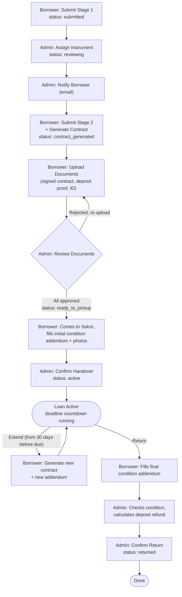

[](https://nextjs.org)
[](https://www.typescriptlang.org)
[](https://www.prisma.io)
[](https://supabase.com)
[](https://vercel.com)

# BATON

> Base for Assets, Tools, and Orchestral Needs


A web platform for OSUI Mahawaditra's Logistics division to manage instrument borrowing and inventory — replacing a patchwork of Google Forms, Sheets, and Word documents with one integrated system.


## Contents

- [BATON](#baton)
  - [Contents](#contents)
  - [Why is this a thing?](#why-is-this-a-thing)
  - [Features](#features)
    - [For borrowers](#for-borrowers)
    - [For admins](#for-admins)
    - [Borrowing Flow](#borrowing-flow)
  - [Technical Decisions \& Challenges](#technical-decisions--challenges)
    - [Puppeteer only fully works locally](#puppeteer-only-fully-works-locally)
    - [No login for borrowers](#no-login-for-borrowers)
    - [Keeping the free-tier services awake](#keeping-the-free-tier-services-awake)
    - [From one combined upload to one-per-document](#from-one-combined-upload-to-one-per-document)
    - ["Ongoing loans" is a timestamp, not a status](#ongoing-loans-is-a-timestamp-not-a-status)
    - [Two inputs for one field](#two-inputs-for-one-field)
    - [Sharing one instrument between two borrowers](#sharing-one-instrument-between-two-borrowers)
    - [One name, more than one display](#one-name-more-than-one-display)
  - [Tech Stack](#tech-stack)
  - [Getting Started](#getting-started)
    - [Prerequisites](#prerequisites)
    - [Setup](#setup)
  - [Project Structure](#project-structure)
  - [Testing](#testing)

## Why is this a thing?

I'm an alumnus of OSUI Mahawaditra year 2020. I happened to be the Deputy Head (2022) and Head of its logistics division (2023), so handling CALANG (Calon Anggota/new member) borrowing instruments from the orchestra meant a patchwork of Google Forms, spreadsheets, and Word documents, and that patchwork had _real_ problems:

- Inventory in Sheets frequently went stale, because every update was manual
- Because everything was manual, indolence is (quite predictably) inevitable to keep track of borrowers, deposits, and deadlines — the admin team had to constantly chase down borrowers for updates
- Even after reorganizing the sheets with color coding and all, I found out not everyone share the same spirit to keep it organized
- Condition reports for extensions (addendums) were unstructured Word docs, hard to compare from one loan to the next
- Contracts were filled in by hand — typos and inconsistent file & document conventions were common
- Deadline reminders and deposit status were both tracked manually, that is, not tracked at all until the admin team realized an instrument was still witheld by someone (now who's at fault for that really?)

BATON is built halfly as a handoff tool and a personal project that I'll keep maintaining for... As long as I can remember, or needed, really. Whoever holds the head-of-logistics position each year becomes **Ketua** — day-to-day access to requests, inventory, and document review, plus full control over configuration (Loan Settings, deposit amounts, the signatory data printed on every contract) and their own team's accounts, so they can onboard incoming staff and deactivate outgoing ones themselves. Their team gets plain **Staff** access — same day-to-day work, minus configuration and admin management. Above them sit the two permanent **Pengurus** accounts (PI OSUI and Logistik OSUI), who share the day-to-day access but can add and deactivate any Ketua or Staff, and me as **Overlord**, permanently — the only role that can deactivate a Pengurus. Pengurus and Overlord are direct database changes, not something the UI exposes.

It's also deliberately still hybrid with the existing Google ecosystem, not a full replacement of it: files still live in the shared logistics division's Drive folder, admins still log in with their Google account, and the physical, stamped contract is still the document that's actually legally binding. BATON's job is to make the process **_around_** that. Tracking, reminders, status, history — structured and hard to get wrong (I hope), not to throw away what already worked.

Scale-wise: roughly 10–20 borrowers a year realistically, busiest in during the Prelude phase around September-October, with around numerous active instruments in the inventory.

Oh and it is, of course, **_mobile friendly_**. Borrowers are expected to just use the generally more simplistic interface of requesting (the public pages), while admins can manage the requests and inventory effectively on the go and generally uses it more they can install it as a progressive web app (PWA) on their phone.

One principle I always keep in mind is **_"Make websites that I, myself, would want to use."_** and BATON is designed (hopefully) to work well on phones and tablets as well as desktops, with a responsive layout and touch-friendly controls.

## Features

### For borrowers

- Public request form, no account required
- A unique, bookmarkable status page per request (`/status/[ticket_id]`), gated by an access code
- Two-stage form: light info up front, full contract details only once an instrument is actually assigned
- Self-service document upload (signed contract, deposit proof, ID scan)
- A deadline countdown that shifts from green, to yellow at 7 days out, to red once overdue
- One-click extension request (from 30 days before the due date) and early return
- A web form — with phone-camera photos — for the condition addendums at pickup, extension, and return
- Automatic email notifications at each status change
- A landing-page FAQ, and a direct WhatsApp and/or LINE line to the logistics head, each shown independently when they choose to

### For admins

- Dashboard: requests needing action, recent activity, and the active loan roster — with a one-click carry-over that moves long-running loans into a separate _ongoing_ roster before each intake season
- Real-time instrument inventory, sortable/filterable, edited from a per-instrument detail page, each with a catalog photo (crop and rotate on upload)
- Configurable instrument sharing: how many borrowers a given instrument type can have on loan at once — Ketua and Overlord only, visible but locked for everyone else
- A separate goods inventory (manual CRUD), catalog photos and all
- One-click inventory snapshot export to XLSX, saved to Drive and downloaded
- Prefilled contract PDF generation
- Document review (approve/reject), with an in-app viewer for uploaded condition photos
- Deposit tracking
- Extension and return handling
- Per-instrument history page
- Annual settings (due dates, bank details, deposit amount, signatory data) — Ketua and Overlord only, visible but locked for everyone else
- Admin management — Ketua (staff only), Pengurus and Overlord (staff and Ketua), each limited to deactivating roles below their own
- Ketua handover — the outgoing Ketua deletes all staff and seats the next Ketua in one step, then leaves BATON from a locked-down page by attaching a photo. Their name, section, term year and the staff they led stay behind as a placard on the public **BATON Legacy** page (`/legacy`); activity history keeps their names even though the accounts are gone

### Borrowing Flow



Not in the diagram, three exceptions branch off the main path:

- **Reject** — an admin can reject a request any time before it's `active` (typically: no matching instrument in stock). Any reserved instrument goes back to `available` — unless it's [shared](#sharing-one-instrument-between-two-borrowers) and another borrower is still actively holding it, in which case its status is left alone,
- **Cancel** — a borrower can cancel their own request any time up through `ready_to_pickup`. Once the instrument is physically handed over (`active`), it can no longer be cancelled.
- **Overdue** — not a manual action at all. A daily cron job flips `active` requests past their `due_date` to `overdue`; a return can still be confirmed from there.

## Technical Decisions & Challenges

A few choices worth explaining, because the reasoning isn't obvious from the code alone.

### Puppeteer only fully works locally

Generating the prefilled contract PDF renders an HTML template with Puppeteer. Regular `puppeteer` bundles a full Chromium binary, which is fine if run locally but doesn't fit inside a Vercel serverless function. I... might've found out about it a tad bit too late, the first deploy of contract generation failed because the bundled Chromium was too large for the function. The fix is a `NODE_ENV`-based branch in `src/lib/contract-pdf.ts`: `puppeteer-core` + `@sparticuz/chromium-min` (a Chromium build trimmed for serverless) in production, plain `puppeteer` locally, where a full install is no problem.

### No login for borrowers

Borrowers touch the platform a handful of times a year at most, so requiring them to create an account felt like unnecessary friction for something this infrequent. Instead, each request gets a `ticket_id` (used as the URL, effectively public) and a separate `access_code` (the actual secret), generated on submission and sent by email. The access code gates every read and write on that ticket — not just the initial page load — so knowing or guessing a `ticket_id` alone doesn't expose someone else's request. Initially I considered sending the credentials via WhatsApp, but as of building this, let's just say this project is _completely free of cost_, so email it is.

### Keeping the free-tier services awake

Supabase's free tier pauses a database after a stretch of inactivity, and Upstash's free tier deactivates an unused Redis database the same way — neither plays well with BATON's actual usage pattern: bursts during intake season, quiet stretches the rest of the year with some bits of updates on instruments when needed. `/api/cron/keepalive`, triggered daily by Vercel Cron, runs a bare `SELECT 1` against Postgres and a `PING` against Redis to keep both from being auto-paused. The route itself is locked behind a `CRON_SECRET` bearer token, since it's meant to be called by the scheduler, not relying on someone opening the URL by hand.

Rate limiting fails open for the same reason: if Redis is ever unreachable, the request is let through and the error goes to Sentry, rather than locking borrowers out of a form over a side service.

### From one combined upload to one-per-document

Document upload originally submitted all three required files: signed contract, deposit proof, and ID scan in a single form and a single `submitDocuments` call (one upload stream). That ran into a real limit: Vercel's function body cap is a hard 4.5MB, not configurable, and BATON's own setting (`next.config.ts`, `serverActions.bodySizeLimit`) sat a notch below that at 4MB. With three files sharing one request, the per-file limit had to be split three ways (~1.3MB each). But even so, a couple of large scans or high-resolution photos could push the _combined_ upload over the limit even when every individual file was valid on its own.

The fix was to split the transport, not the form: the borrower still picks all three files and presses one button, but the client then calls the server action once per file, one after another, each request carrying a single file with the full ~4MB budget to itself instead of a shared one. Next.js dispatches Server Actions one at a time per client anyway, so the sequence is explicit (`src/lib/sequential-upload.ts`) rather than a `Promise.all` that would only pretend to be parallel. A file that is too large is caught in the browser before anything is sent (a body over the 4MB limit is rejected by Next with a 413 before the action even runs, which the client can only see as a generic failure, so the server's own size message would almost never be reached) and reported under its own field, and a file the server rejects for another reason (wrong type) is reported the same way, while the others still go through. A request-level failure such as a wrong access code stops the run so nothing else is attempted. The completion check (the one that flips the request to `documents_uploaded` and notifies the admin) lives on the server and simply re-runs after every individual upload, so it fires at the right moment whichever document happens to land last, without needing a separate "batch complete" step. When the admin rejects one document, the borrower sees only that one slot again and re-uploads just that file.

### "Ongoing loans" is a timestamp, not a status

Right before the Prelude intake season, the admin team wants the active-loan roster to show _this_ batch of borrowers — not the stragglers still holding instruments from earlier in the year. But a straggler loan isn't a different kind of loan: it's still active, still counting down, still extendable, still flipped to `overdue` by the same daily cron. A new status would have meant every one of those paths having to learn about it.

So "ongoing" is just a nullable `carriedOverAt` timestamp on the request. One admin action stamps it, in bulk, on every active loan the moment before intake opens; the dashboard and the requests table then partition the roster on that one field — null is "active", set is "ongoing" — and nothing else in the system has to care. Confirming an extension sets it automatically (a loan old enough to extend belongs with the carried-over group anyway), and a per-loan button clears it again. A boolean would have worked too, but the timestamp also records _when_ the line was drawn, which turns out to be the part worth keeping.

### Two inputs for one field

The borrower's faculty and major are stored — and printed on the contract — as a single `Faculty/Major` string, and the form used to collect them that way too: one text box, with a rule that there be exactly one slash in it. People kept failing that rule — a fullwidth `／` from a phone keyboard, no slash at all, a stray trailing one. It's now two separate inputs, joined on the server. The stored value and the contract come out identical to before, so there was nothing to migrate.

### Sharing one instrument between two borrowers

A handful of instrument types — Contrabass being the recurring example — exist in numbers too small for demand, so the org's actual practice is to let a second borrower take one on while the first is still holding it, each signing their own contract and addendum for that same physical unit. That last part matters: if the second borrower is the one who damages it, they're liable for it, not whoever borrowed it first. Before this was built in, the workaround was a note in the instrument's Notes field and asking the second borrower to just wait.

`Instrument.status` and `location` were both built assuming exactly one borrower at a time: a single enum value, a single string overwritten on every handover. Neither can represent "two people currently have an active claim on this Contrabass." Making that representable meant treating both as _derived_ rather than _stored_ — `location` is computed at read time from every `BorrowingRequest` currently attached to that instrument, instead of being written by whichever borrower's handover happens to run last (which would just clobber the other borrower's name). Whether a new request can be assigned an instrument at all works the same way: a count against `InstrumentTypeSlot.maxConcurrentLoans` (configurable per instrument type, default 1) instead of a plain `status === "available"` check. An instrument's condition and status only get their final, post-loan value recorded once the _last_ remaining borrower returns it — anyone returning while someone else still holds it just closes out their own loan, nothing on the instrument itself changes.

The one thing that turned out not to need any change at all was liability tracking: each borrower already gets their own `BorrowingRequest` → `LoanPeriod` → `Addendum` chain, so two people sharing one instrument were always going to end up with two separate contracts and two separate condition reports. That part of the data model was right from the start — the gap was purely in how the shared instrument's own state got represented.

### One name, more than one display

Borrowers fill in their name in full, but that's rarely how anyone actually refers to them day to day — and once an instrument can have two active borrowers at once, showing two full names side by side in one place gets long enough to be genuinely hard to read. The fix is a second, optional `borrowerNickname` field — but which of the two gets shown isn't the same everywhere, because the display rule depends on who's looking and why:

- To the borrower themselves (their emails, their own status page, the shared instrument's location) — nickname, falling back to the full name if they left it blank.
- To admin staff trying to recognize a specific person (the requests/archive tables, a request's detail page, an instrument's borrower history, the internal notification emails) — both, as `Full Name (Nickname)`.
- Anywhere that's effectively a legal record (the contract PDF, the Drive folder a borrower's documents get archived under) — full name only, untouched.

Two small pure functions in `loan-rules.ts`, `resolveNickname` and `formatNameWithNickname`, encode those two display rules; every call site picks whichever one matches its audience rather than reading `borrowerName` directly. Requests submitted before this field existed just have a `null` nickname — both functions fall back to the full name for those, so nothing looks broken for old data.

## Tech Stack

| Layer              | Choice                                                      | Why                                                                                                 |
| ------------------ | ----------------------------------------------------------- | --------------------------------------------------------------------------------------------------- |
| Framework          | Next.js 16 (App Router)                                     |                                                                                                     |
| Language           | TypeScript 5                                                |                                                                                                     |
| UI                 | Tailwind CSS 4, shadcn/ui, Base UI, TanStack Table          |                                                                                                     |
| Database           | PostgreSQL via Supabase                                     |                                                                                                     |
| ORM                | Prisma 7 + `@prisma/adapter-pg`                             | Prisma 7 requires an explicit driver adapter — a plain `new PrismaClient()` throws                  |
| Auth               | Better Auth (Google OAuth)                                  | admin login only; borrowers use the ticket/access-code flow instead                                 |
| File storage       | Google Drive API, OAuth-as-user with the `drive.file` scope | keeps files inside the existing OSUI Drive folder; no service account, no broader scope than needed |
| PDF generation     | Puppeteer / `puppeteer-core` + `@sparticuz/chromium-min`    | see [Technical Decisions](#technical-decisions--challenges)                                         |
| Spreadsheet export | SheetJS `xlsx`, installed from the official SheetJS CDN     | the `xlsx` package on the npm registry is stale and carries known vulnerabilities                   |
| Email              | Nodemailer (Gmail)                                          |                                                                                                     |
| Validation         | Zod 4                                                       |                                                                                                     |
| Rate limiting      | Upstash Redis + `@upstash/ratelimit`                        | serverless functions are stateless — an in-memory counter resets on every invocation                |
| Testing            | Vitest                                                      |                                                                                                     |
| Error tracking     | Sentry                                                      |                                                                                                     |
| Hosting            | Vercel, with Vercel Cron for scheduled jobs                 |                                                                                                     |

## Getting Started

### Prerequisites

- Node.js ≥ 20.9
- A PostgreSQL database — Supabase is what this project is built and tested against (connection pooling setup assumes it)
- A Google Cloud project with OAuth credentials and the Drive API enabled
- An Upstash Redis database, if you want rate limiting active locally

### Setup

Clone and install:

```bash
git clone <repo-url>
cd baton
npm install
```

`npm install` also runs `prisma generate` automatically, via the `postinstall` script.

Copy the environment template and fill it in:

```bash
cp .env-example .env
```

| Variable                                                                                           | Purpose                                                        |
| -------------------------------------------------------------------------------------------------- | -------------------------------------------------------------- |
| `DATABASE_URL`                                                                                     | Pooled (transaction-mode) Postgres connection, used at runtime |
| `DIRECT_URL`                                                                                       | Session-mode Postgres connection, used for migrations          |
| `BETTER_AUTH_SECRET`                                                                               | Better Auth session signing secret                             |
| `BETTER_AUTH_URL`                                                                                  | Public base URL, no trailing slash; used in OAuth and emails   |
| `GOOGLE_CLIENT_ID` / `GOOGLE_CLIENT_SECRET`                                                        | Google OAuth app credentials (admin login and Drive access)    |
| `GOOGLE_DRIVE_REFRESH_TOKEN`                                                                       | Long-lived token for OAuth-as-user Drive access                |
| `GOOGLE_DRIVE_ROOT_FOLDER_ID`                                                                      | Drive folder BATON uses as its root                            |
| `GMAIL_USER` / `GMAIL_APP_PASSWORD`                                                                | Outgoing email                                                 |
| `CRON_SECRET`                                                                                      | Shared secret checked by every `/api/cron/*` route             |
| `CONTRACT_FONT_REGULAR_DRIVE_ID` / `CONTRACT_FONT_BOLD_DRIVE_ID` / `CONTRACT_FONT_ITALIC_DRIVE_ID` | Drive file IDs for the contract PDF's embedded fonts           |
| `UPSTASH_REDIS_REST_URL` / `UPSTASH_REDIS_REST_TOKEN`                                              | Rate limiting store                                            |

<!-- PERSONAL: if you keep a private setup doc (Drive folder structure, OAuth consent screen steps, etc.), link it here instead of re-explaining it in this README. -->

Set up the database:

```bash
npx prisma migrate dev
npx prisma db seed
```

The seed reads the real inventory from `prisma/seed-data/instruments.xlsx` and `prisma/seed-data/goods.xlsx`. Those two files are gitignored — they're the org's actual inventory — so a fresh clone needs its own copies, with the same column headers `prisma/seed.ts` reads.

To wipe a database back to a clean slate and re-seed it (after a round of testing, say), run `npm run db:reset`. It validates both spreadsheets before touching anything, lists exactly what it is about to delete, keeps Overlord and Pengurus accounts and Loan Settings (and refuses to run without at least one Overlord), and only continues if you type `RESET` in an interactive terminal. Afterwards it prints which Drive folders are safe to clear by hand, since a database reset doesn't touch Drive.

Run the dev server:

```bash
npm run dev
```

Open [http://localhost:3000](http://localhost:3000).

## Project Structure

```
src/
  app/
    admin/       Admin panel — dashboard, inventory, requests, settings.
                 Access-gated by proxy.ts (Next.js 16's replacement for middleware.ts),
                 not by per-page checks.
    api/         Route Handlers: /api/auth (Better Auth), /api/cron (reminders, keepalive),
                 /api/status/[ticket_id]/contract (contract PDF download, gated by a
                 60-second signed token)
    legacy/      Public BATON Legacy wall (/legacy) and the routes that serve its photos
    limbo/       Where a Ketua ends up after starting a handover: no exits, one photo to attach
    request/     Public borrowing request form
    status/      Public per-ticket status page (access-code gated)
  components/    Shared UI components
  lib/           Business logic and integrations — Prisma client, Google Drive, email,
                 PDF generation, rate limiting, pure rule functions (loan-rules.ts),
                 role hierarchy (roles.ts), the Ketua handover transaction (handover.ts),
                 and the enum → label maps the UI reads (labels.ts)
scripts/         One-off maintenance scripts, e.g. upload-legacy-crew.ts (puts the founding
                 crew's photos on Drive) and cleanup-legacy-test.ts (removes test tombstones)
prisma/
  schema.prisma  Database schema (16 models)
  migrations/    Migration history
  seed.ts        Seeds instruments and goods from prisma/seed-data/*.xlsx (gitignored)
  reset.ts       Guarded wipe behind `npm run db:reset` — keeps Overlord, Pengurus and Loan Settings
```

## Testing

```bash
npm test          # run once
npm run test:watch # watch mode
```

Coverage is aimed at the business-logic layer that would cause real problems if it silently broke, rather than at a coverage percentage:

- `roles.ts` / `handover.ts` — who may manage whom (the full role-versus-role matrix), and the two-step Ketua handover run against a fake transaction: staff are removed before the new Ketua is created, every refusal happens before anything is written, and a second tab cannot complete a handover twice
- `loan-rules.ts` — deposit refund calculation, instrument status transitions on return, extension eligibility, required documents per loan period, instrument-sharing slot resolution, and name/nickname display resolution
- `id-generators.ts` — `ticket_id` / `access_code` generation, including uniqueness under collision
- `format.ts` / `mail.ts` — date/timezone handling, activity-log and annual-report wording, email content generation
- `labels.ts` / `StatusBadge` — every value of every Prisma enum the UI shows needs a human label, checked against the _generated_ enums, so a new enum value without one fails the tests instead of leaking to the screen as `need_repair`; the dropdown option lists must reuse those same labels
- `sequential-upload.ts` — the document upload queue: strictly one request at a time, in order; a per-file error doesn't stop the others, a request-level error does
- `download-token.ts` — the signed, expiring token behind the contract download link: valid for its own ticket only, rejected when expired, tampered with, or malformed


#STANLOONA